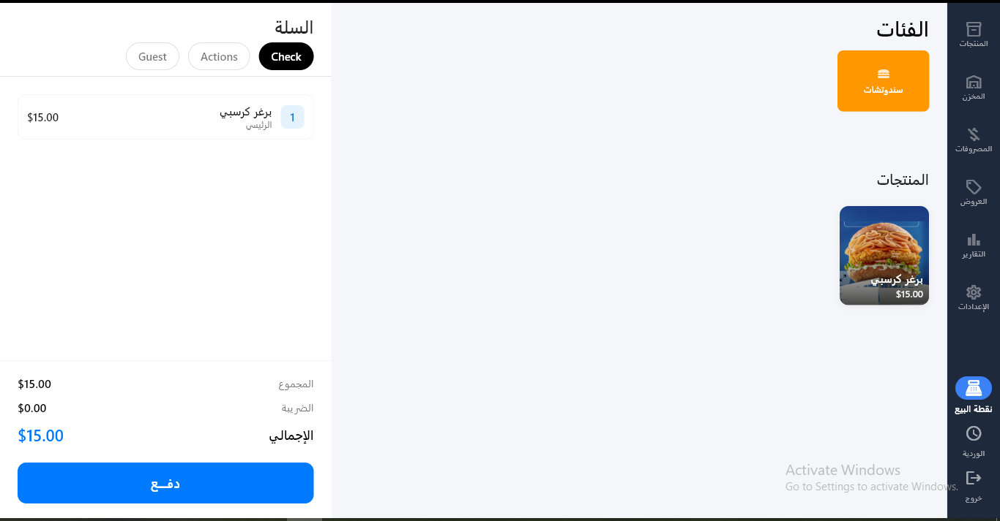
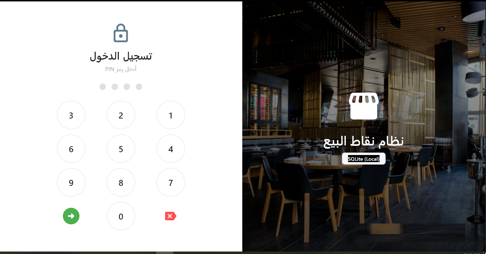
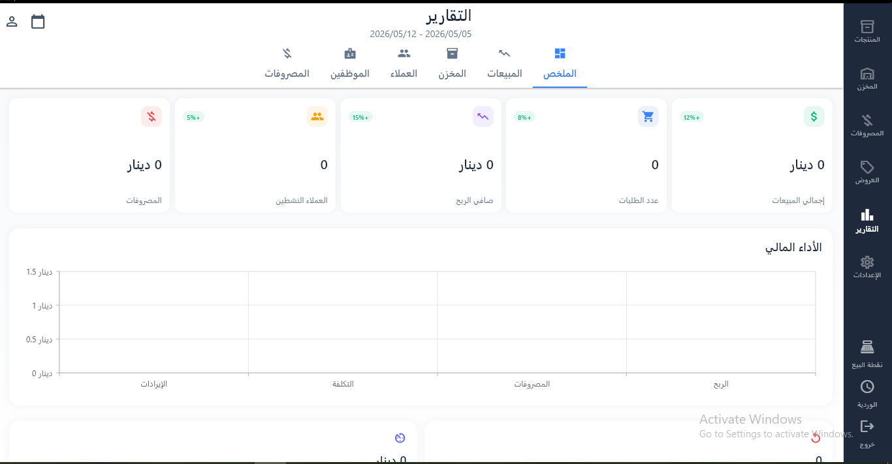
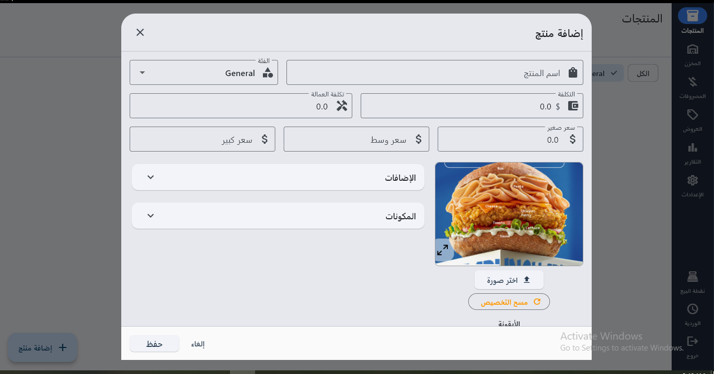

# 🍔 Restaurant POS System | منظومة إدارة المطاعم الذكية



## ✨ عن المشروع (About)
هذا المشروع ليس مجرد واجهة برمجية، بل هو حل متكامل صُمم لتبسيط تجربة إدارة المطاعم. يركز النظام على السرعة في تنفيذ الطلبات، الدقة في الحسابات، وتقديم تجربة مستخدم (UX) سلسة تدعم بيئة العمل المزدحمة.

## 🚀 المميزات الرئيسية (Features)
* **واجهة عصرية:** تصميم متجاوب (Responsive) يدعم الأجهزة اللوحية وأجهزة الكاشير.
* **إدارة الطاولات:** نظام تتبع حي لحالة الطاولات والطلبات المعلقة.
* **التقارير الذكية:** عرض فوري للأرباح والأصناف الأكثر مبيعاً.
* **دعم الطباعة:** توافق تام مع طابعات الفواتير الحرارية.

## 🛠 التكنولوجيات المستخدمة (Tech Stack)
* **Frontend:** Flutter (Cupertino Design for iOS feel)
* **State Management:** Provider / Riverpod
* **Database:** SQL / Firebase
* **Tools:** VS Code, Git

## 📸 معاينة المنظومة
> [!TIP]
> تظهر هنا واجهة المستخدم الاحترافية التي تم تصميمها لتناسب احتياجات المطاعم العصرية.


/

/

/


## 💻 كيف تبدأ؟
```bash
# استنساخ المشروع
git clone [https://github.com/your-username/project-name.git](https://github.com/your-username/project-name.git)

# تحميل المكتبات
flutter pub get

# تشغيل التطبيق
flutter run
